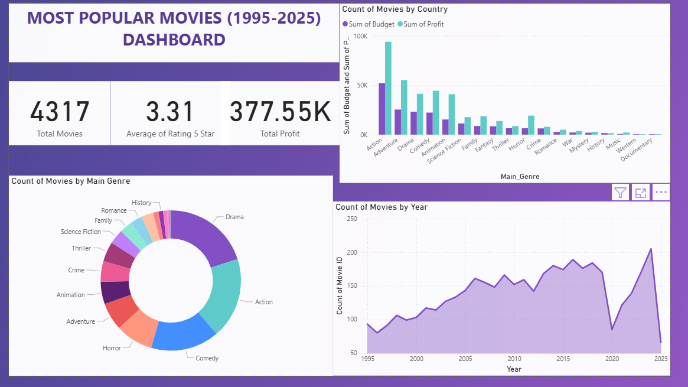
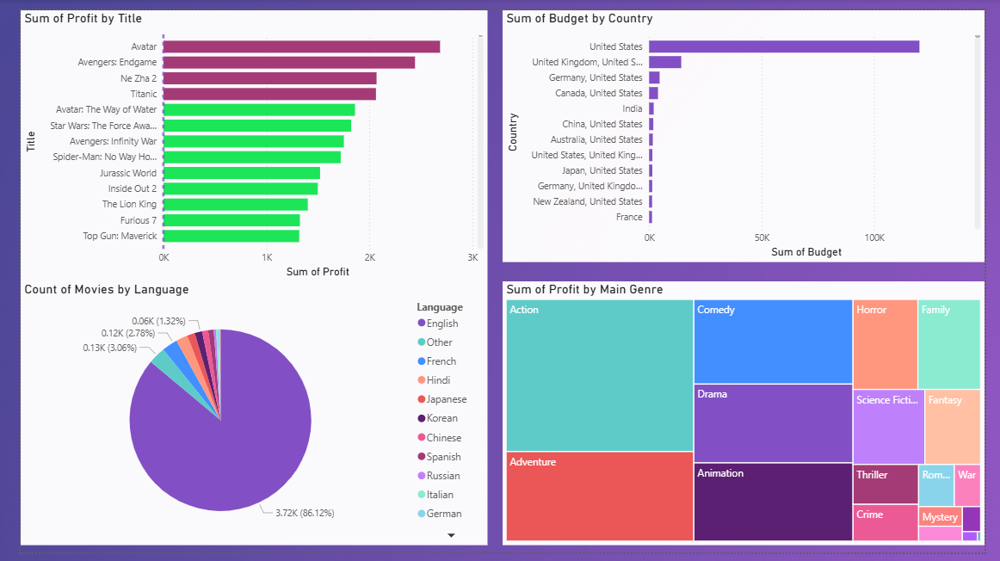
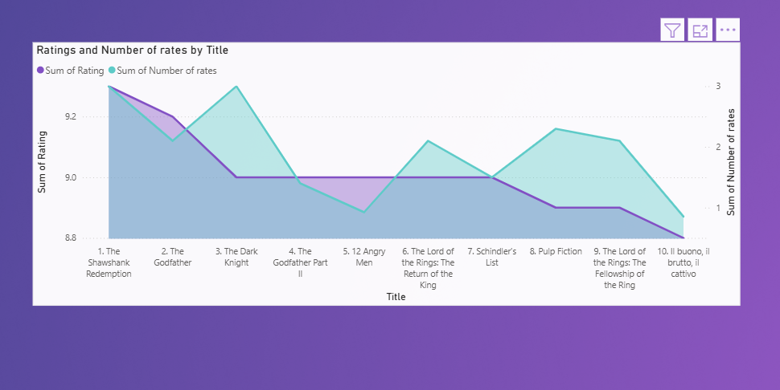

# Popular Movies Dashboard

A dynamic Power BI dashboard visualizing trending movies data scraped from The Movie Database (TMDB) API. Features interactive charts on genres, ratings, profits, release years, and more, powered by a Python ETL pipeline for data cleaning and preparation.

## 📊 Overview

This project analyzes over 4,300 movies from 1995 to 2025, highlighting trends like the dominance of Action and Comedy genres, peak production in 2015-2020, and profitability in English-speaking markets (e.g., U.S., U.K.). Built for data storytelling and movie insights.

## 🚀 Features

- Interactive Power BI visuals: Pie charts for genres, bar charts for ratings/profits, maps for countries, and slicers for years/languages.
- Python pipeline: Scrapes TMDB data (titles, genres, ratings, budgets, revenues) and cleans it into CSV for Power BI import.
- DAX measures for advanced metrics (e.g., average profit per genre).
- Responsive design for desktop and mobile viewing.

## 🛠️ Tech Stack

- **Data Pipeline**: Python (requests, BeautifulSoup, pandas for scraping/cleaning).
- **Visualization**: Power BI Desktop (DAX, M queries).
- **Data Source**: TMDB API (free tier).

## 📸 Screenshots

### Dashboard Overview

## 👩‍💻 Author

Built by [Eya Garali](https://www.linkedin.com/in/eya-garali-a2a410287/).

---
